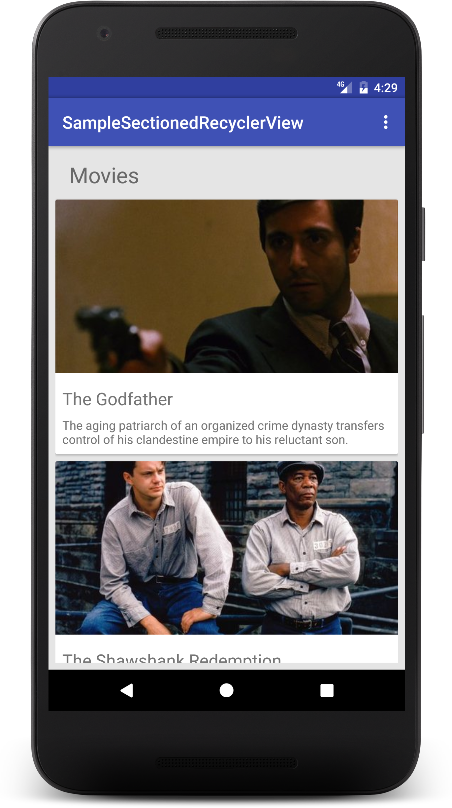
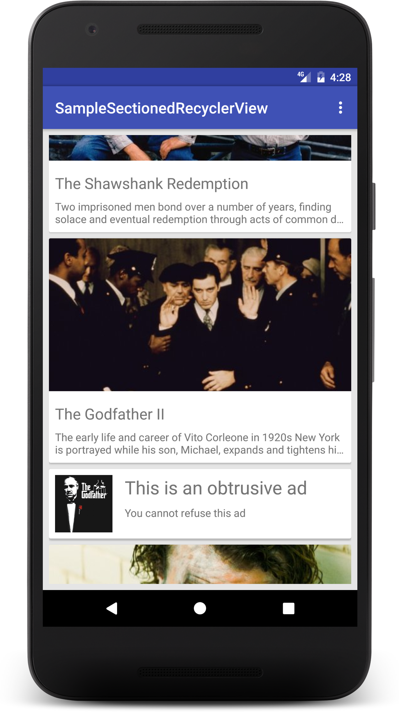

# Sectioned-RecyclerView
RecyclerView with support for sections, headers and adding miscellaneous views at any position.

## Use Case
There are often times when lists to display have complex underlying data beneath them. Take an example of the Play Store home page where the list contains different kinds of data objects (apps, movies, books) in a single list. 


In such cases, maintaining a single underlying data source to the adapter becomes difficult and results in you having to write custom logic for when a certain type of data model appears, with it's custom binding, click listeners etc. 

In such cases, sectioned-recyclerview turns out to be an easy abstraction. 

## Usage

We'll recreate a Play Store like interface (slightly less polished, perhaps) with a list consisting of movies and books, like this :

  

### Sections everywhere!

In the screenshot attached above, we have 5 **Sections**. A **Section** containing all the movies, a **Section** containing all the books, a **Section** for the headers for the movies section and books section and at last, a **Section** for the annoying ad in between the movies.

### Implementing a section

Let's create a section. The boiler plate code for that would be something like : 

```java
public class MoviesSection extends Section<MoviesSection.MoviesHolder> {

    public MoviesSection() {
    }

    @Override
    public void onBind(MoviesHolder holder, final int position) {
        // Implement your stuff here
    }

    @Override
    public int getLayout() {
    	// Return your layout file
        return R.layout.list_item_movie;
    }

    @Override
    public int getItemCount() {
    	// Return size of section. Something like :
    	// return mData.size();
        return 0;
    }

    @Override
    public MoviesHolder getViewHolder(View view) {
        return new MoviesHolder(view);
    }

    public static class MoviesHolder extends RecyclerView.ViewHolder {

        public MoviesHolder(View itemView) {
            super(itemView);
        }
    }
} 
```

### Adapter

```java
public class Adapter extends SectionedRecyclerAdapter<RecyclerView.ViewHolder> {

    private Context mContext;
    private MoviesSection mMoviesSection;
    private BooksSection mBooksSection;

    public Adapter(Context context, final List<Movie> mMovies, List<Book> mBooks) {
        super(context);

        mContext = context;

        mMoviesSection = new MoviesSection(context, mMovies);
        mBooksSection = new BooksSection(context, mBooks);

        addSection(mMoviesSection, mBooksSection);
    }
}
```


